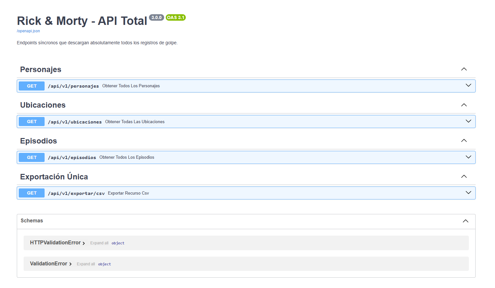
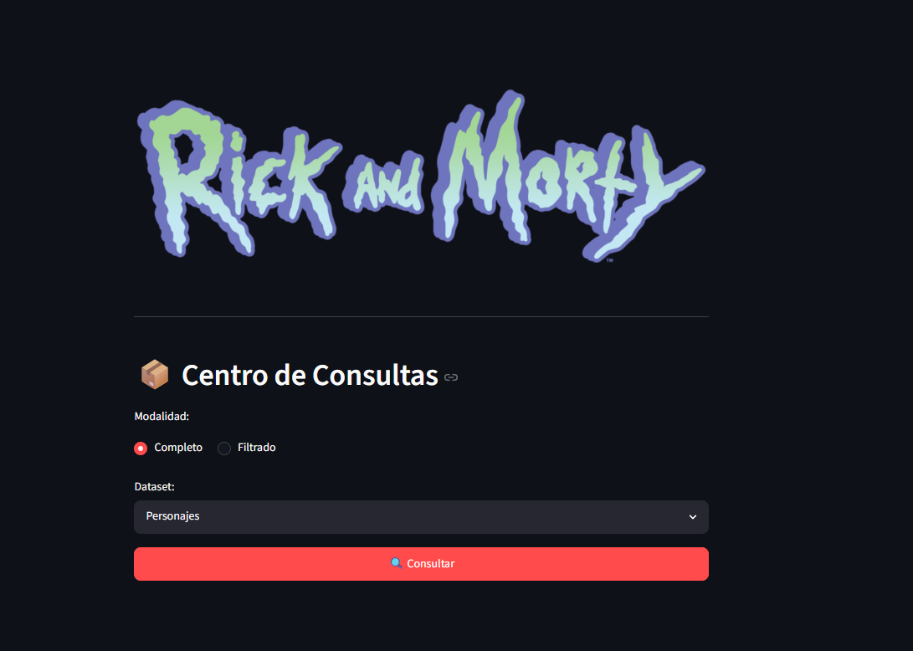
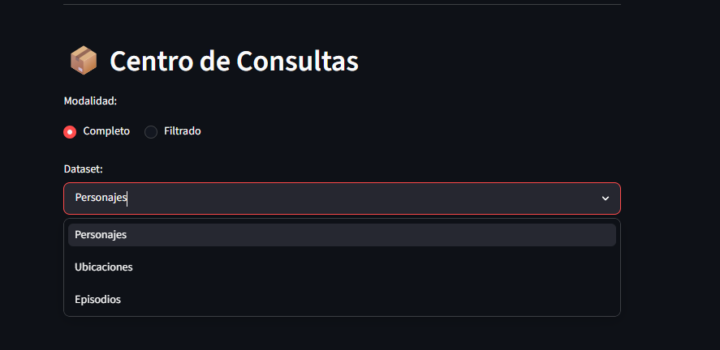
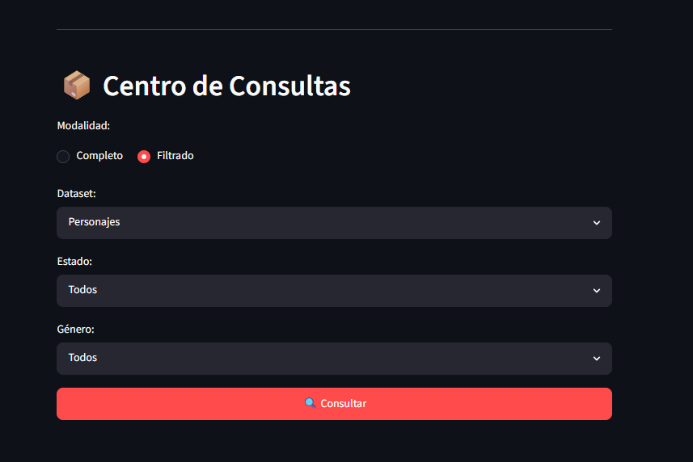
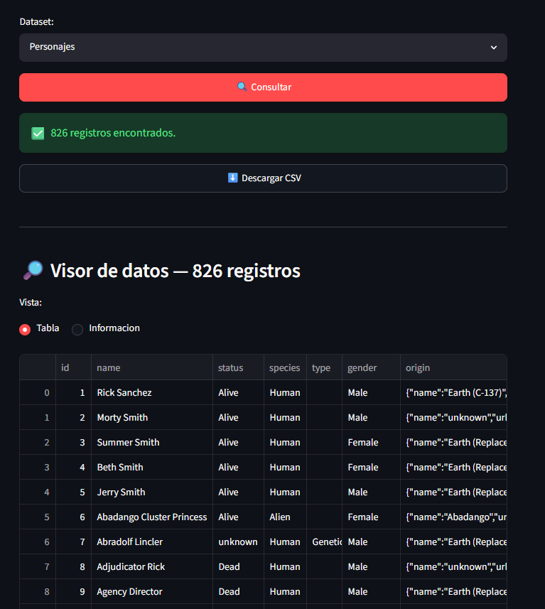
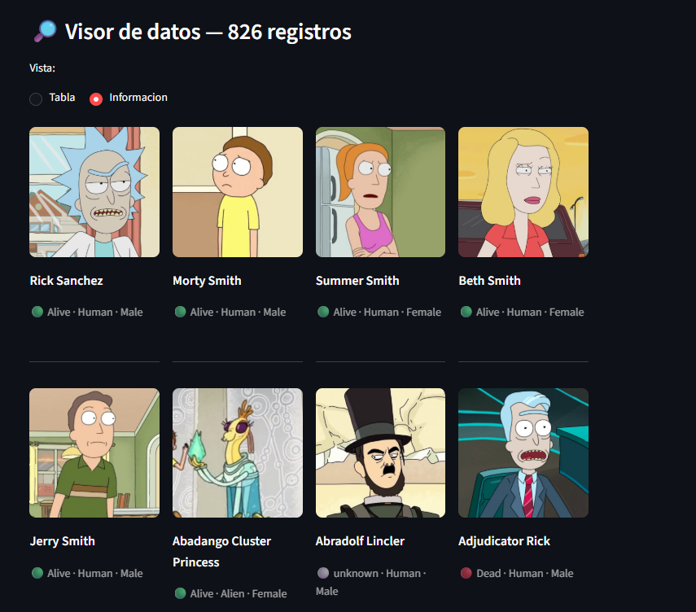
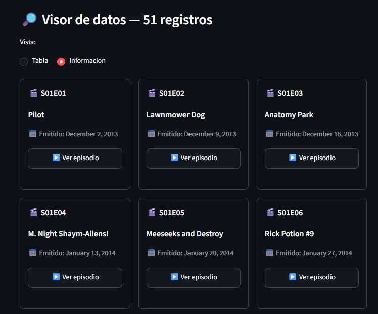

# 🛸 Rick and Morty Prueba Tecnica

<p align="center">
  
</p>

##  Descripción del Proyecto
Esta pequeña prueba tecnica es una Wikipedia dedicada a Rick y Morty donde podremos buscar personajes, episodios y lugares de la serie donde tambien podremos descargar con todo lujo de filtros archivos .CSV y poder ver capitulos de la serie. Se puede ver en la nube en este enlace: pruebaapi.streamlit.app


## Formas de usar

Este proyecto se puede ejecutar de 3 maneras:

1. POSTMAN

Es necesario tener activo fastapi ejecutandolo con este comando: 

```bash
uvicorn main:app --reload
```

**URL del Endpoint:** `http://127.0.0.1:8000/api/v1/exportar/csv`  
**Método:** `GET`

---

Parámetro Obligatorio
* **`recurso`**: Define qué vas a descargar. Opciones: `personajes`, `ubicaciones` o `episodios`.

Filtros Disponibles (Opcionales)
* **Para cualquier recurso:** `name`
* **Solo para Personajes:** `status`, `species`, `type`, `gender`
* **Solo para Ubicaciones:** `type`, `dimension`
* **Solo para Episodios:** `episode`

---
 Ejemplo en Postman / Navegador
Copia esta URL para descargar directamente los personajes que están vivos:
```text
[http://127.0.0.1:8000/api/v1/exportar/csv?recurso=personajes&status=alive](http://127.0.0.1:8000/api/v1/exportar/csv?recurso=personajes&status=alive)

```

2. DOCKER

Requisitos Previos
* Tener **Docker Desktop** instalado y abierto en segundo plano (con el icono de la ballena activo).

Pasos para el Despliegue

  1. **Construye la imagen de la aplicación** (asegúrate de incluir el punto `.` al final):
    ```bash
    docker build -t rick-morty-backend .
    ```
Una vez que el contenedor esta corriendo puedes ejecutar: "http://127.0.0.1:8000/docs"



3. PYTHON
Para correr el proyecto de forma local sin Docker, necesitarás abrir **dos terminales separadas** en tu editor de código.
```bash
uvicorn main:app --reload
```
```bash
streamlit run app.py
```

### 1. Instalar las Dependencias
Abre tu terminal en la raíz del proyecto y ejecuta el siguiente comando para descargar todas las librerías necesarias:
```bash
pip install -r requirements.txt
```

##  Estructura y Diseño

El sistema está desarrollado bajo una arquitectura de **separación de responsabilidades**, estructurada en dos componentes principales que interactúan para ofrecer una experiencia fluida:

### 1. Backend (FastAPI)
La capa de lógica de negocio y gestión de datos.
* **API RESTful:** Desarrollada con **FastAPI**, expone los endpoints necesarios para el consumo de datos por parte del cliente.
* **Capa de Servicios:** Incluye un cliente dedicado (`services/api_client.py`) que centraliza las peticiones a la API oficial de *Rick y Morty*.

### 2. Frontend (Streamlit)
La interfaz de usuario interactiva y orientada al análisis.
* **Visor de Datos:** Permite alternar entre una vista de tabla técnica y un visor de bloques informativos, adaptándose a la necesidad del usuario.
* **Motor de Filtrado:** Sistema avanzado que permite refinar los datos en tiempo real antes de realizar exportaciones a **CSV** donde usamos en (`utils/utils.py`) un metodo para generar el **CSV**
* **Reproducción Multimedia:** Integración de un reproductor de episodios embebido(con anuncios), utilizando una API externa para el despliegue directo de contenido multimedia sobre la interfaz.


## Contenido de la Web

Para empezar podemos ver una interfaz simple donde tendremos varias opciones para descargar el .CSV, tienes filtros para cada apartado.




Cuando se selecciona una opcion, tendremos opcion de descargar los datos como de visualizarlos tanto en formato tabla como en formato imagen.



Por ultimo pero no menos importante, si se selecciona el apartado de episodios podra seleccionar el capitulo que quiera y se le mostrara un reproductor con el episodio.



